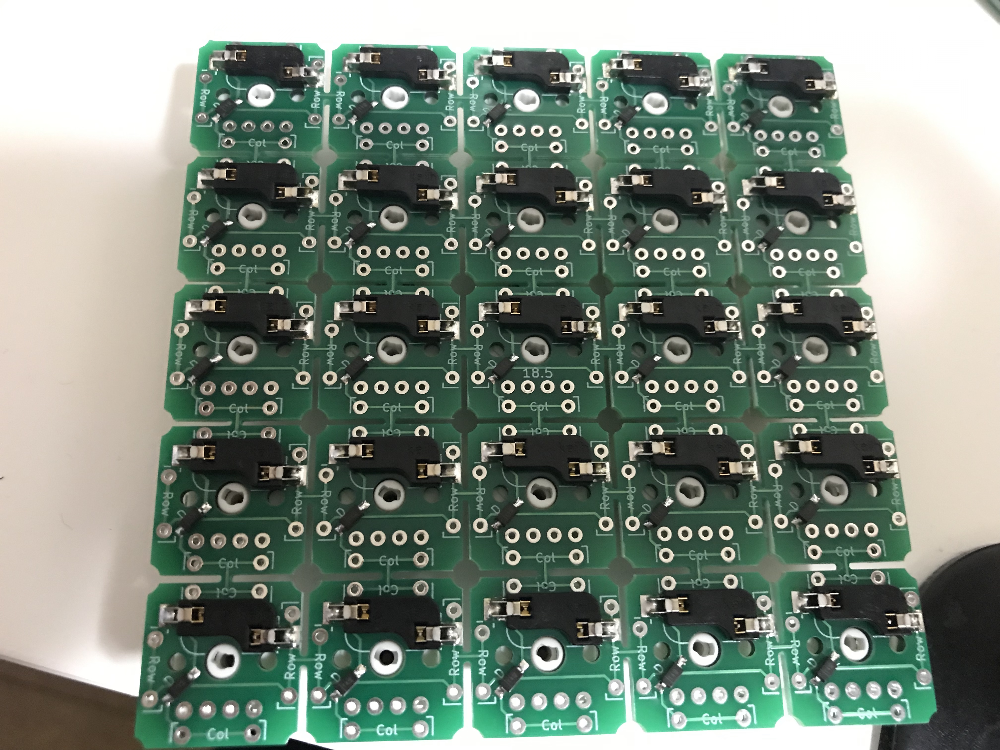
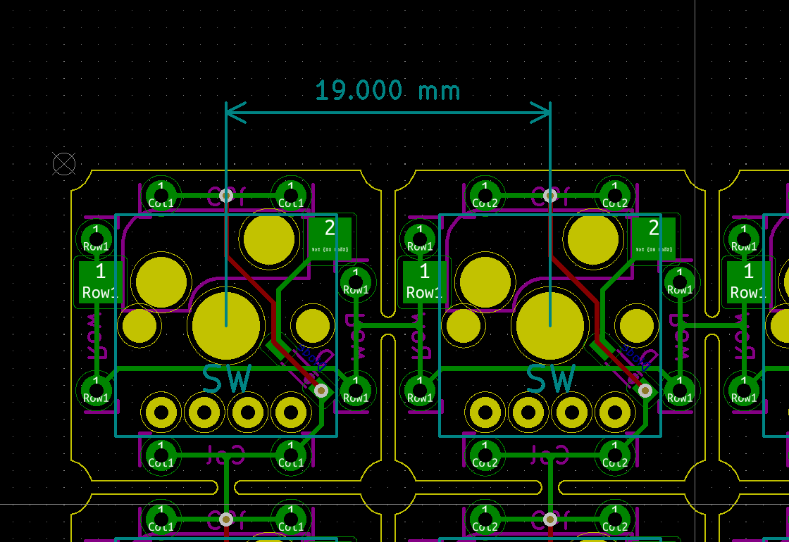
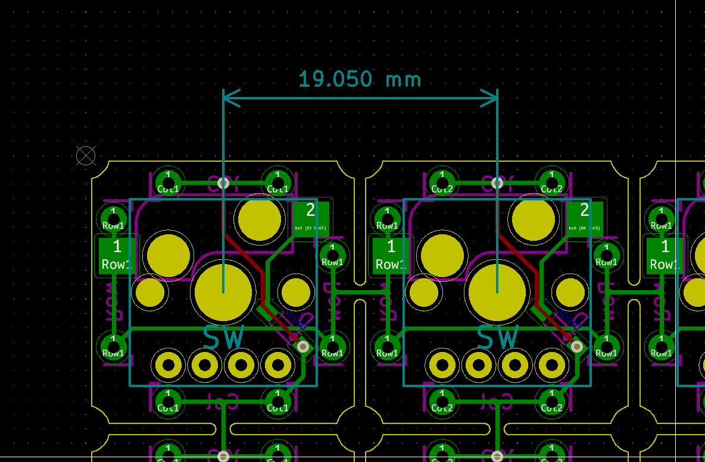
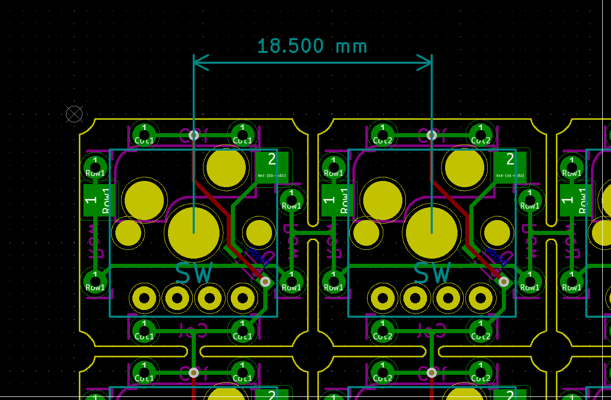

# Cherry-Mx-Bitboard-Re

[Cherry-Mx-Bitboard](https://github.com/ogatatsu/Cherry-Mx-Bitboard)のソケット対応版。

基板間は最初から配線してあり必要ならば割って使う感じ。キーピッチは3パターンあります。

## 部品

| Name | Description | Manufacturer
----|----|----
| SW | Socket, CPG151101S11| Kailh |
| D | Diode, 1N4148W | Diodes Incorporated |

リード線タイプのダイオードは未対応。

## License

https://creativecommons.org/licenses/by/4.0/
